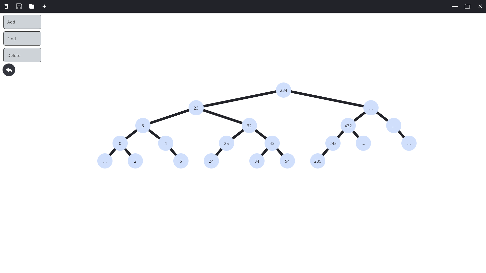
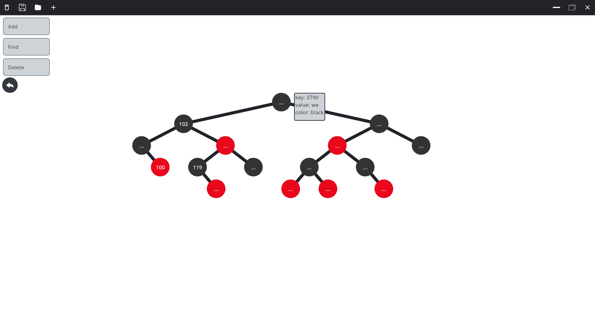

<p align="center">


</p>


## Tree Structure


This project will help the user to build an RBT, AVL or binary tree. Add, delete, or search for elements in it.
<!-- You don't have to answer all the questions - just the ones relevant to your project. -->

## Features
With **trees-1** you can do the following:
- Create three kinds of binary search trees: **Binary search tree**, **AVL tree**, **Red-black tree**
- Using the GUI, perform the following operations (**insert**, **delete**, **search**)
- Save and load trees into databases (**json files** for binary, **SQLite** for AVL-tree, **neo4j** for RB-tree)
- Use an independent library with the implementation of these trees in your project

## Get it!
Important: To build and run the application, you will need the following tools: Gradle, JDK (version 17 and latest) and Neo4j.
### Quick start
```bash
# Clone this repo
git clone https://github.com/spbu-coding-2022/trees-1.it

# Build
./gradlew build

# Build Docker (link)

# Run 
./gradlew run
```
If you only want to use the library, you need to follow these steps:
```bash
# Find the "dependencies" block and add the dependency line to it:

# If in your project build.gradle.kts:
implementation("com.github.spbu-coding-2022:trees-1:1.0.0")
# If in your project build.gradle:
implementation 'com.github.spbu-coding-2022:trees-1:1.0.0'

# Save the changes in the build file
```
## Neo4j setup
1. Install docker
2. Install docker compose (https://docs.docker.com/compose/install/)
3. Run in project dir:
```bash
docker compose -f "docker-compose.yml" up
```
4. If you're having trouble getting started, check out this [GUIDE](https://www.baeldung.com/ops/docker-cannot-connect#:~:text=Due%20to%20Inactive%20Docker%20Service)


## See examples




## Contacts
For all questions: [Click](http://telegram.me/LesokSupportbot)

## License 
This project uses the **APACHE LICENSE, VERSION 2.0**. See the [LICENSE](LICENSE.md) for more info.

<a name="bottom" href="https://github.com/spbu-coding-2022/trees-1"></a><br>


